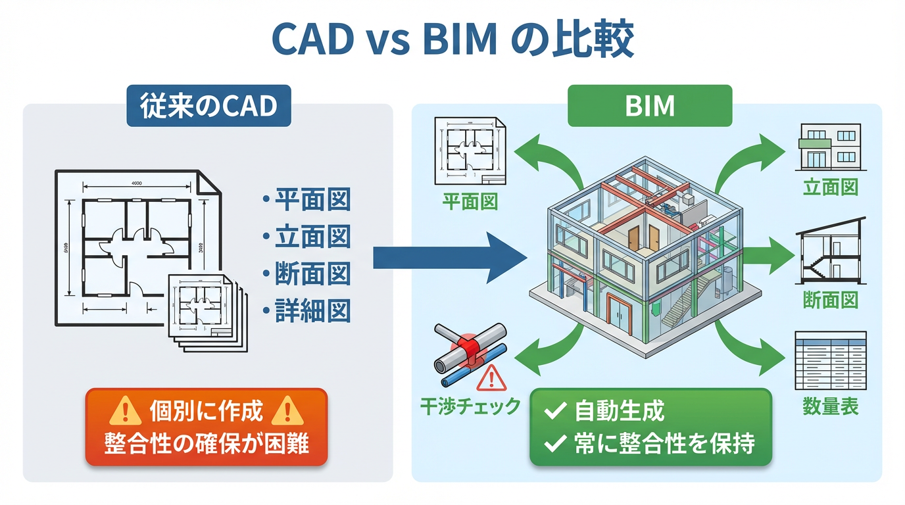
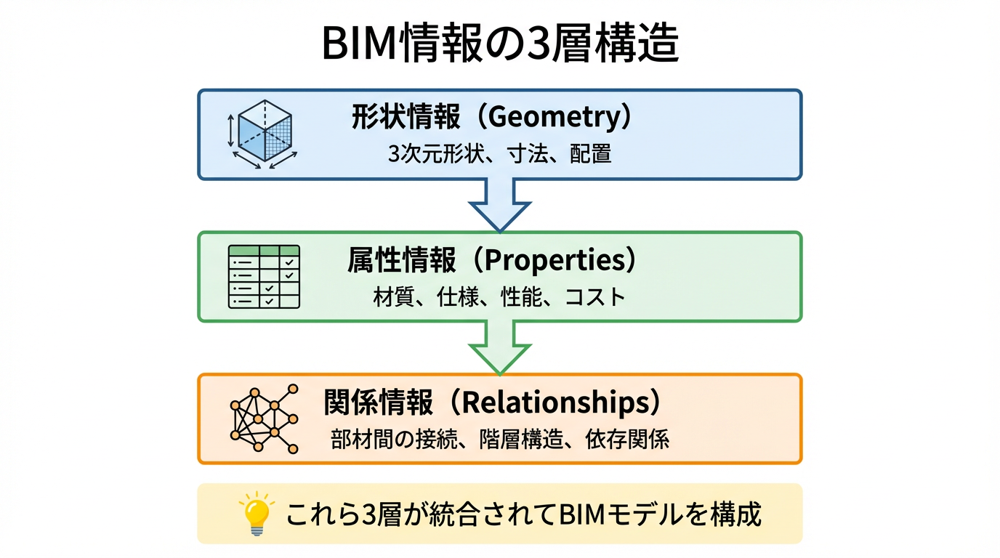
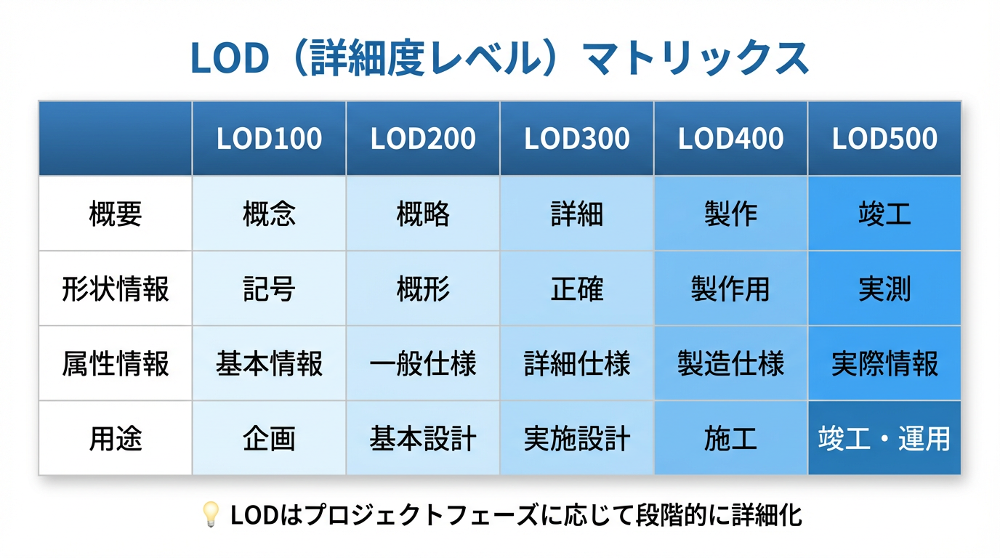
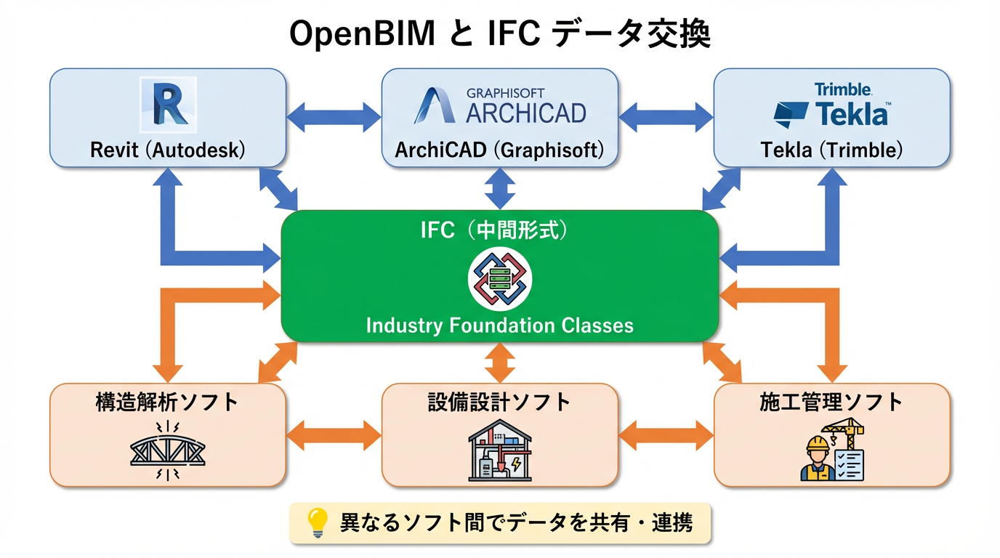
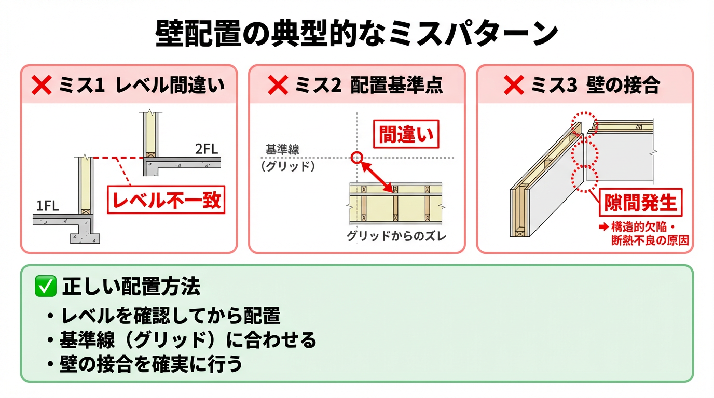
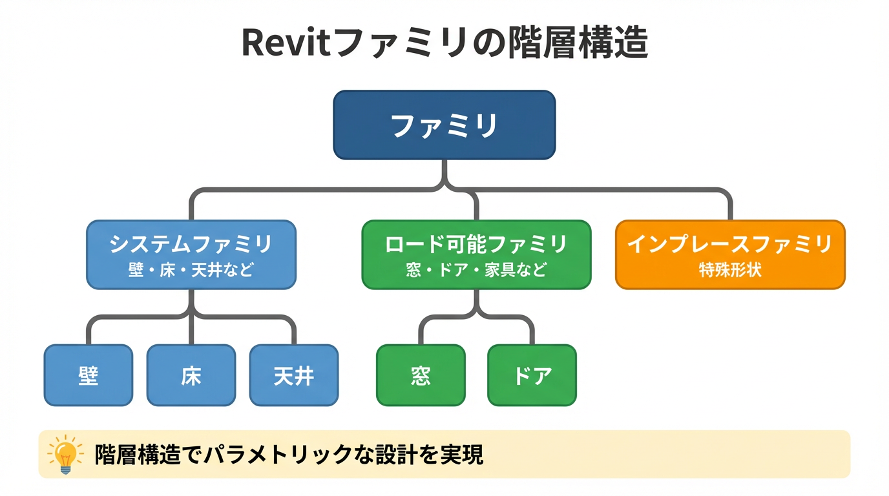

# 📊 図表一覧

本教材シリーズでは、Python（matplotlib）で自動生成された図表を**15種類**収録しています。

全ての図表はPNG形式（150 DPI）で、試験対策や学習に最適化されています。

---

## 📊 図表リスト

### 1. CAD vs BIM 比較図
**ファイル**: `assets/figs/cad_vs_bim.png`

従来のCADとBIMの違いを視覚的に比較。線・面・図形による表現と、情報を持つ部材（Element）による表現の違いを示します。

**関連章**: VOL1 第1章



---

### 2. BIM情報の3層構造
**ファイル**: `assets/figs/info_layers.png`

BIMモデルが持つ3つの情報層を図解：
- **形状情報（Geometry）**: 3D形状
- **属性情報（Properties）**: 材質、仕上げ、コストなど
- **関係性（Relationships）**: 部材同士の接続・依存関係

**関連章**: VOL1 第3章



---

### 3. 建築ライフサイクルフロー
**ファイル**: `assets/figs/lifecycle_flow.png`

建築生産プロセスの全体像：
1. 企画（Planning）
2. 設計（Design）
3. 施工（Construction）
4. 維持管理（Operation & Maintenance）

各フェーズでのBIMの活用方法を示します。

**関連章**: VOL1 第2章


---

### 4. 部材（Element）の構造
**ファイル**: `assets/figs/element_structure.png`

BIMモデルの基本単位である「部材（Element）」の内部構造：
- タイプパラメータ（Type Parameters）
- インスタンスパラメータ（Instance Parameters）
- ファミリ（Family）の階層

**関連章**: VOL1 第3章


---

### 5. LODマトリクス
**ファイル**: `assets/figs/lod_matrix.png`

Level of Development（LOD）の各段階を表形式で整理：

| LOD | 段階 | 詳細度 | 用途 |
|-----|------|--------|------|
| LOD 100 | 概念 | 概略ボリューム | 企画・基本構想 |
| LOD 200 | 概略設計 | おおよその形状・サイズ | 基本設計 |
| LOD 300 | 詳細設計 | 詳細な形状・主要属性 | 実施設計 |
| LOD 400 | 製作 | 製作詳細・組立情報 | 施工図・製作図 |
| LOD 500 | 竣工 | 竣工実測値・維持管理情報 | 維持管理 |

**関連章**: VOL1 第4章



---

### 6. OPEN BIMとIFC連携図
**ファイル**: `assets/figs/openbim_ifc.png`

異なるBIMソフトウェア間でのデータ交換の仕組み：
- IFC（Industry Foundation Classes）を中心としたデータ交換
- Revit、ArchiCAD、Vectorworksなどの連携
- buildingSMARTの役割

**関連章**: VOL1 第5章



---

### 7. レベル設定の誤り例と正解例
**ファイル**: `assets/figs/ng_ok_level_mistake.png`

よくあるレベル設定のミス：
- ❌ NG例: 壁の上端を数値入力
- ✅ OK例: 壁の上端を上階レベルに参照

**関連章**: VOL2 第1章、第4章


---

### 8. レベル設定ミスの詳細図（6パターン）
**ファイル**: `assets/figs/level_mistake_detail.png`

準1級試験で頻出のレベル設定ミス6パターンを図解：

1. 床レベルの誤設定（1階の床を2FLに作成）
2. 壁の下端レベル誤設定
3. 壁の上端を数値入力（レベル参照なし）
4. 天井高さの固定値設定
5. 階高変更時の追随漏れ
6. 複数階での一貫性欠如

**関連章**: VOL2 第4章


---

### 9. 壁の高さ設定ミスパターン
**ファイル**: `assets/figs/wall_mistake_patterns.png`

壁の高さ設定における典型的なミス：
- ❌ NG1: 上端を数値入力（例: 3000mm）
- ❌ NG2: 下端レベルを誤設定
- ✅ OK: 上端を「上階レベル」に参照

階高変更時の追随性を確保する方法を図解。

**関連章**: VOL2 第4章



---

### 10. 床配置のよくある失敗例
**ファイル**: `assets/figs/floor_mistake_examples.png`

床の配置における典型的なミス：
- ❌ NG1: 2階の床を1FLに作成（高さ3m低い）
- ❌ NG2: 境界線の不正確さ
- ❌ NG3: 開口部の処理ミス
- ✅ OK: 正しいレベルに正確に配置

**関連章**: VOL2 第4章


---

## 🎨 図表の生成方法

すべての図表は、Pythonスクリプト（`src/diagrams.py`）で自動生成されています。

```bash
# 図表を再生成
cd /home/user/webapp/bim-textbook-series
python src/diagrams.py
```

図表は `assets/figs/` ディレクトリに PNG 形式で保存されます。

---

## 📝 図表の活用方法

### 学習時
- 各章の理解を深めるために参照
- 誤解しやすいポイントを視覚的に確認

### 試験対策時
- 第4章（よくある失敗例）の図を暗記
- 正誤パターンを視覚的に記憶

### 講義・セミナー時
- PDFを印刷して配布資料として活用
- プロジェクターで投影して説明

---

## ✅ 追加済みの図表（11～15）

### 11. BEP（BIM実行計画）フロー図
**ファイル**: `assets/figs/bep_flow.png`

BIM実行計画の8つの構成要素をフローチャートで図解。

**関連章**: VOL1 第6章


---

### 12. 4D/5D BIM概念図
**ファイル**: `assets/figs/4d_5d_bim.png`

多次元BIM（nD BIM）の概念：
- 3D: 空間モデル
- 4D: +時間軸（工程）
- 5D: +コスト
- 6D: +維持管理
- 7D: +サステナビリティ

**関連章**: VOL1 第2章


---

### 13. ワークシェアリング概念図
**ファイル**: `assets/figs/worksharing_concept.png`

複数人での同時作業の仕組み：
- 中央ファイル（Central File）
- ローカルコピー
- 同期（Synchronize with Central）

**関連章**: VOL2 第2章


---

### 14. Revitファミリ階層詳細
**ファイル**: `assets/figs/family_hierarchy_detail.png`

Revitのファミリ構造を4階層で図解：
1. プロジェクト
2. カテゴリ
3. ファミリタイプ
4. インスタンス

**関連章**: VOL1 第3章



---

### 15. 干渉チェック（Clash Detection）
**ファイル**: `assets/figs/clash_detection.png`

干渉検出の具体例：
- 配管と梁の干渉
- ダクトと壁の干渉
- 解決策の提示

**関連章**: VOL1 第6章、VOL2 第3章


---

**最終更新**: 2025年12月27日  
**図表総数**: 15種類
